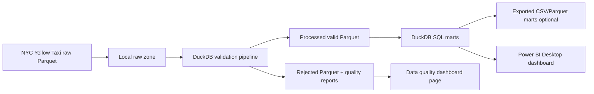

# NYC Taxi Cloud-Ready Data Engineering Pipeline

A production-style Data Engineering portfolio project that demonstrates an end-to-end pipeline for NYC Taxi trip data using **Apache Airflow**, **MinIO local object storage**, **DuckDB**, and **CSV analytics exports**.

This project was originally designed for a GCP-based architecture using Google Cloud Storage and BigQuery. However, due to cloud billing and prepayment constraints during development, the current implementation uses **MinIO as a local object storage substitute for GCS** and **DuckDB as a local analytical warehouse**.

The pipeline is designed to be cloud-ready, meaning the object storage and warehouse layers can be migrated to **Google Cloud Storage** and **BigQuery** in the future when billing is available.

---

## Current Architecture

```text
NYC Taxi Raw Parquet Files
        ↓
Airflow DAG: Check Raw Files
        ↓
Airflow DAG: Upload Raw Files to MinIO
        ↓
MinIO Bucket: nyc-taxi-raw
        ↓
Airflow DAG: Verify MinIO Objects
        ↓
DuckDB Local Warehouse
        ↓
Staging and Mart Tables
        ↓
Airflow DAG: Export Marts to CSV
        ↓
Dashboard-ready CSV Outputs
```

---

## Completed Pipeline Stages

| Phase   | Description                                                    | Status      |
| ------- | -------------------------------------------------------------- | ----------- |
| Phase 1 | Airflow local setup with Docker, PostgreSQL, Redis, and MinIO  | Completed   |
| Phase 2 | Upload NYC Taxi raw parquet files to MinIO object storage      | Completed   |
| Phase 3 | Build DuckDB staging and mart tables from verified raw files   | Completed   |
| Phase 4 | Export DuckDB mart tables to CSV files for dashboard/reporting | Completed   |
| Phase 5 | README and portfolio cleanup                                   | In Progress |
| Future  | GCS and BigQuery integration when cloud billing is available   | Planned     |

---

## Why MinIO Instead of GCS?

The original plan was to use Google Cloud Storage and BigQuery. During setup, Google Cloud required a prepayment before enabling full cloud resources. To avoid unnecessary cost during learning and portfolio development, this project uses **MinIO** as a local object storage layer.

This keeps the engineering design realistic while controlling cost:

* MinIO bucket simulates a cloud raw data zone
* Airflow orchestrates the full workflow
* DuckDB works as a lightweight local analytical warehouse
* CSV exports provide dashboard-ready outputs
* The same architecture can later be migrated to GCS and BigQuery

---

## Current Tech Stack

| Layer               | Tool                           |
| ------------------- | ------------------------------ |
| Orchestration       | Apache Airflow                 |
| Container Runtime   | Docker Desktop + WSL 2         |
| Object Storage      | MinIO                          |
| Local Warehouse     | DuckDB                         |
| Data Format         | Parquet, CSV                   |
| Transformation      | SQL                            |
| Version Control     | Git, GitHub                    |
| Future Cloud Target | Google Cloud Storage, BigQuery |
---
## DuckDB Mart Tables

| Table | Description |
|---|---|
| `stg_taxi_trips` | Cleaned and typed taxi trip records |
| `mart_daily_kpis` | Daily trip count, revenue, average fare, distance, and duration |
| `mart_hourly_demand` | Trip demand and revenue by pickup hour |
| `mart_payment_mix` | Trip distribution and revenue by payment type |
| `mart_data_quality_summary` | Basic data quality summary for raw trip data |

## CSV Export Outputs

The final mart tables are exported to `exports/marts/` for dashboard or reporting use.

Generated files:

```text
exports/marts/
├── mart_daily_kpis.csv
├── mart_hourly_demand.csv
├── mart_payment_mix.csv
└── mart_data_quality_summary.csv

## Portfolio Value

This project demonstrates the ability to upgrade a local analytics workflow into a cloud-based data engineering pipeline. It highlights practical skills that are commonly required in Data Engineer roles, including orchestration, cloud storage, data warehousing, SQL transformation, data quality, and documentation.

The project is built step by step to show not only the final result, but also the learning process and engineering decisions behind the pipeline.

# NYC Taxi Local Analytics Pipeline

Portfolio project สำหรับสร้าง data pipeline แบบไม่ใช้ Cloud จาก NYC Yellow Taxi monthly Parquet files ไปสู่ local validated data lake, DuckDB SQL marts และ Power BI Desktop dashboard

## Why No Cloud

- ingest และ validate Parquet files ขนาดหลายล้านแถว
- แยก raw, processed และ rejected zones
- ทำ data quality checks พร้อม rejected reason
- สร้าง SQL marts ด้วย DuckDB
- ออกแบบ dashboard สำหรับ analyst ด้วย Power BI Desktop
- เขียน docs, tests และ Git workflow แบบ portfolio-ready

## Current Dataset

Raw data อยู่ที่:

```text
C:\data-engineering-portfolio\Project_nyc-taxi-gcp-data-pipeline\nyc-taxi-gcp-data-pipeline\data\raw
```

ไฟล์ที่มีตอนนี้:

```text
yellow_tripdata_2026-01.parquet
yellow_tripdata_2026-02.parquet
yellow_tripdata_2026-03.parquet
```

Source grain:

```text
1 row = 1 NYC Yellow Taxi trip
```

## Architecture



## Project Structure

```text
nyc-taxi-gcp-data-pipeline/
├── data/
│   ├── raw/
│   ├── processed/
│   └── rejected/
├── docs/
│   ├── DASHBOARD_DESIGN.md
│   ├── DATA_MODEL.md
│   ├── LOCAL_ANALYTICS_SETUP.md
│   ├── PROJECT_ROADMAP.md
│   ├── STEP_BY_STEP_GUIDE.md
│   └── data_dictionary.md
├── logs/
├── reports/
├── sql/
│   └── duckdb/
├── src/
├── tests/
├── .env.example
├── .gitignore
├── requirements.txt
└── README.md
```

## Quick Start

### 1. Go to project folder

```powershell
cd C:\data-engineering-portfolio\Project_nyc-taxi-gcp-data-pipeline\nyc-taxi-gcp-data-pipeline
```

### 2. Use the virtual environment

```powershell
.\.venv\Scripts\Activate.ps1
```

If you need to recreate it:

```powershell
python -m venv .venv
.\.venv\Scripts\Activate.ps1
python -m pip install --upgrade pip
pip install -r requirements.txt
```

If PowerShell blocks `Activate.ps1` with `running scripts is disabled on this system`, you can skip activation and run the virtual environment Python directly:

```powershell
.\.venv\Scripts\python.exe -m pip install -r requirements.txt
.\.venv\Scripts\python.exe -m src.inspect_data
.\.venv\Scripts\python.exe -m src.main
.\.venv\Scripts\python.exe -m pytest -q
```

Alternative temporary fix for the current PowerShell window only:

```powershell
Set-ExecutionPolicy -Scope Process -ExecutionPolicy Bypass
.\.venv\Scripts\Activate.ps1
```

### 3. Inspect source files

```powershell
.\.venv\Scripts\python.exe -m src.inspect_data
```

### 4. Run local validation pipeline

```powershell
.\.venv\Scripts\python.exe -m src.main
```

Expected outputs:

```text
data/processed/year=2026/month=01/yellow_tripdata_2026-01_valid.parquet
data/rejected/year=2026/month=01/yellow_tripdata_2026-01_rejected.parquet
reports/yellow_tripdata_2026-01_quality.csv
logs/pipeline.log
```

### 5. Run tests

```powershell
.\.venv\Scripts\python.exe -m pytest -q
```

### 6. Export dashboard marts for Power BI

```powershell
.\.venv\Scripts\python.exe -m src.export_marts
```

Expected outputs:

```text
exports/mart_daily_kpis.csv
exports/mart_overall_kpis.csv
exports/mart_hourly_demand.csv
exports/mart_payment_mix.csv
exports/mart_zone_pair_performance.csv
exports/mart_data_quality_summary.csv
```

## Data Quality Rules

A valid trip must satisfy:

- pickup and dropoff timestamps are present
- dropoff time is later than pickup time
- trip duration is no more than `MAX_TRIP_HOURS`
- trip distance is zero or greater
- total amount is zero or greater
- pickup and dropoff location IDs are positive
- pickup timestamp belongs to the source file month

Invalid rows are preserved in `data/rejected` with a `rejection_reason`.

## Local SQL Marts

SQL files:

```text
sql/duckdb/01_create_core_views.sql
sql/duckdb/02_create_dashboard_marts.sql
sql/duckdb/03_data_quality_checks.sql
```

Recommended marts:

- `vw_trip_enriched`
- `mart_daily_kpis`
- `mart_hourly_demand`
- `mart_payment_mix`
- `mart_zone_pair_performance`
- `mart_trip_outliers`
- `mart_data_quality_summary`

## Dashboard Tool

Recommended tool: **Power BI Desktop**

Use Power BI Desktop to connect to exported mart CSV/Parquet files or to the processed Parquet folder. The dashboard should include:

- Executive Overview
- Demand Patterns
- Revenue and Fare
- Zone / Route Performance
- Data Quality

ดูรายละเอียดใน `docs/DASHBOARD_DESIGN.md`

## Dashboard Preview

The final Power BI dashboard is documented as GitHub-friendly screenshots:

- [Executive Overview](docs/images/dashboard-01-executive-overview.png)
- [Demand Patterns](docs/images/dashboard-02-demand-patterns.png)
- [Revenue and Fare](docs/images/dashboard-03-revenue-and-fare.png)
- [Zone / Route Performance](docs/images/dashboard-04-zone-route-performance.png)
- [Data Quality](docs/images/dashboard-05-data-quality.png)


## Learning Path

ถ้าคุณกำลังทำตามทีละขั้น ให้เริ่มจาก:

1. `docs/STEP_BY_STEP_GUIDE.md`
2. `docs/DATA_MODEL.md`
3. `docs/LOCAL_ANALYTICS_SETUP.md`
4. `docs/DASHBOARD_DESIGN.md`
5. `docs/PROJECT_ROADMAP.md`

## GitHub Notes

Do commit:

- source code
- SQL
- docs
- tests
- sample configs

Do not commit:

- raw Parquet files
- processed/rejected data
- `.env`
- credentials
- logs and generated reports
- exported marts and local `.duckdb` database files
