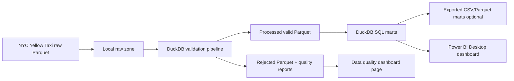

# NYC Taxi GCP Airflow BigQuery ELT Pipeline

A production-style data engineering project that demonstrates the evolution of a local analytics pipeline into a cloud-based ELT pipeline using **Apache Airflow**, **Google Cloud Storage**, and **Google BigQuery**.

This project is designed to show practical Data Engineering skills, including pipeline orchestration, cloud data lake ingestion, BigQuery data warehouse modeling, SQL-based ELT transformation, data quality checks, and dashboard-ready analytics marts.

---

## Project Evolution

| Version | Pipeline Type            | Main Tools                    | Status      |
| ------- | ------------------------ | ----------------------------- | ----------- |
| V1      | Local Analytics Pipeline | Python, DuckDB, SQL, Power BI | Completed   |
| V2      | Cloud ELT Pipeline       | Airflow, GCS, BigQuery, SQL   | In Progress |

---

## V1: Local Analytics Pipeline

The first version of this project focuses on building a local-first analytics pipeline without cloud billing.

### V1 Workflow

```text
NYC Taxi Parquet Files
        ↓
Python Validation
        ↓
DuckDB Local Warehouse
        ↓
SQL Analytics Marts
        ↓
Power BI Dashboard-ready Outputs
```

### V1 Key Features

* Local data ingestion using Python
* Data validation before loading
* DuckDB local analytical database
* SQL-based transformation
* Dashboard-ready mart tables
* Power BI-ready exports
* Basic data quality checks

---

## V2: GCP Airflow BigQuery ELT Pipeline

The second version upgrades the local pipeline into a cloud-based ELT pipeline using Google Cloud Platform.

### V2 Target Architecture

```text
NYC Taxi Parquet Files
        ↓
Apache Airflow DAG
        ↓
Google Cloud Storage
        ↓
BigQuery Raw Tables
        ↓
BigQuery Staging Tables
        ↓
BigQuery Warehouse Tables
        ↓
BigQuery Mart Tables
        ↓
Data Quality Checks
        ↓
Dashboard-ready Analytics
```

### V2 Planned Features

* Apache Airflow orchestration
* Google Cloud Storage raw data zone
* BigQuery raw, staging, warehouse, and mart layers
* SQL-based ELT transformation
* Incremental loading by month
* BigQuery partitioning and clustering
* Automated data quality checks
* Pipeline audit logs
* Dashboard-ready mart tables
* Documentation for setup, data model, and architecture

---

## Tech Stack

| Category        | Tools                       |
| --------------- | --------------------------- |
| Language        | Python, SQL                 |
| Orchestration   | Apache Airflow              |
| Cloud Storage   | Google Cloud Storage        |
| Data Warehouse  | Google BigQuery             |
| Local Analytics | DuckDB                      |
| BI / Dashboard  | Power BI / Looker Studio    |
| Version Control | Git, GitHub                 |
| Environment     | Docker, Virtual Environment |

---

## Repository Structure

```text
.
├── dags/                         # Airflow DAG files
├── data/                         # Local data folders
│   ├── raw/
│   ├── processed/
│   └── rejected/
├── docs/
│   └── gcp/                      # GCP, Airflow, and BigQuery documentation
├── sql/
│   ├── duckdb/                   # V1 local SQL models
│   └── bigquery/                 # V2 BigQuery SQL models
│       ├── raw/
│       ├── staging/
│       ├── warehouse/
│       ├── marts/
│       └── data_quality/
├── src/
│   └── gcp/                      # Python scripts for GCP pipeline
├── dashboards/
│   └── screenshots/              # Dashboard and pipeline screenshots
├── requirements.txt
├── .env.example
├── .gitignore
└── README.md
```

---

## Learning Objectives

This project is part of my Data Engineering learning path. The main objective is to strengthen practical skills in:

* Building end-to-end data pipelines
* Designing local and cloud-based data workflows
* Using Airflow for orchestration
* Loading data into Google Cloud Storage and BigQuery
* Creating analytical data models with SQL
* Applying data quality checks
* Preparing analytics marts for dashboards
* Documenting data engineering projects professionally

---

## Current Development Status

| Step     | Task                                                     | Status      |
| -------- | -------------------------------------------------------- | ----------- |
| Step 0   | Create Git branch for GCP version                        | Completed   |
| Step 1   | Add GCP / Airflow / BigQuery folder structure            | Completed   |
| Step 1.5 | Update `.gitignore` for local, database, and cloud files | Completed   |
| Step 2   | Update README for V1 / V2 project positioning            | In Progress |
| Step 3   | Add Airflow local setup                                  | Not Started |
| Step 4   | Create first Airflow DAG                                 | Not Started |
| Step 5   | Add GCS upload script                                    | Not Started |
| Step 6   | Load data from GCS to BigQuery                           | Not Started |
| Step 7   | Build BigQuery staging and mart tables                   | Not Started |
| Step 8   | Add data quality checks                                  | Not Started |

---

## Portfolio Value

This project demonstrates the ability to upgrade a local analytics workflow into a cloud-based data engineering pipeline. It highlights practical skills that are commonly required in Data Engineer roles, including orchestration, cloud storage, data warehousing, SQL transformation, data quality, and documentation.

The project is built step by step to show not only the final result, but also the learning process and engineering decisions behind the pipeline.

# NYC Taxi Local Analytics Pipeline

Portfolio project สำหรับสร้าง data pipeline แบบไม่ใช้ Cloud จาก NYC Yellow Taxi monthly Parquet files ไปสู่ local validated data lake, DuckDB SQL marts และ Power BI Desktop dashboard

## Why No Cloud

โปรเจกต์นี้ตั้งใจทำแบบ local-first เพราะไม่ต้องใช้บัตรเครดิตหรือ cloud billing แต่ยังโชว์ทักษะ Data Engineering ที่สำคัญได้ครบ:

- ingest และ validate Parquet files ขนาดหลายล้านแถว
- แยก raw, processed และ rejected zones
- ทำ data quality checks พร้อม rejected reason
- สร้าง SQL marts ด้วย DuckDB
- ออกแบบ dashboard สำหรับ analyst ด้วย Power BI Desktop
- เขียน docs, tests และ Git workflow แบบ portfolio-ready

## Current Dataset

Raw data อยู่ที่:

```text
C:\data-engineering-portfolio\Project_nyc-taxi-gcp-data-pipeline\nyc-taxi-gcp-data-pipeline\data\raw
```

ไฟล์ที่มีตอนนี้:

```text
yellow_tripdata_2026-01.parquet
yellow_tripdata_2026-02.parquet
yellow_tripdata_2026-03.parquet
```

Source grain:

```text
1 row = 1 NYC Yellow Taxi trip
```

## Architecture



## Project Structure

```text
nyc-taxi-gcp-data-pipeline/
├── data/
│   ├── raw/
│   ├── processed/
│   └── rejected/
├── docs/
│   ├── DASHBOARD_DESIGN.md
│   ├── DATA_MODEL.md
│   ├── LOCAL_ANALYTICS_SETUP.md
│   ├── PROJECT_ROADMAP.md
│   ├── STEP_BY_STEP_GUIDE.md
│   └── data_dictionary.md
├── logs/
├── reports/
├── sql/
│   └── duckdb/
├── src/
├── tests/
├── .env.example
├── .gitignore
├── requirements.txt
└── README.md
```

## Quick Start

### 1. Go to project folder

```powershell
cd C:\data-engineering-portfolio\Project_nyc-taxi-gcp-data-pipeline\nyc-taxi-gcp-data-pipeline
```

### 2. Use the virtual environment

```powershell
.\.venv\Scripts\Activate.ps1
```

If you need to recreate it:

```powershell
python -m venv .venv
.\.venv\Scripts\Activate.ps1
python -m pip install --upgrade pip
pip install -r requirements.txt
```

If PowerShell blocks `Activate.ps1` with `running scripts is disabled on this system`, you can skip activation and run the virtual environment Python directly:

```powershell
.\.venv\Scripts\python.exe -m pip install -r requirements.txt
.\.venv\Scripts\python.exe -m src.inspect_data
.\.venv\Scripts\python.exe -m src.main
.\.venv\Scripts\python.exe -m pytest -q
```

Alternative temporary fix for the current PowerShell window only:

```powershell
Set-ExecutionPolicy -Scope Process -ExecutionPolicy Bypass
.\.venv\Scripts\Activate.ps1
```

### 3. Inspect source files

```powershell
.\.venv\Scripts\python.exe -m src.inspect_data
```

### 4. Run local validation pipeline

```powershell
.\.venv\Scripts\python.exe -m src.main
```

Expected outputs:

```text
data/processed/year=2026/month=01/yellow_tripdata_2026-01_valid.parquet
data/rejected/year=2026/month=01/yellow_tripdata_2026-01_rejected.parquet
reports/yellow_tripdata_2026-01_quality.csv
logs/pipeline.log
```

### 5. Run tests

```powershell
.\.venv\Scripts\python.exe -m pytest -q
```

### 6. Export dashboard marts for Power BI

```powershell
.\.venv\Scripts\python.exe -m src.export_marts
```

Expected outputs:

```text
exports/mart_daily_kpis.csv
exports/mart_overall_kpis.csv
exports/mart_hourly_demand.csv
exports/mart_payment_mix.csv
exports/mart_zone_pair_performance.csv
exports/mart_data_quality_summary.csv
```

## Data Quality Rules

A valid trip must satisfy:

- pickup and dropoff timestamps are present
- dropoff time is later than pickup time
- trip duration is no more than `MAX_TRIP_HOURS`
- trip distance is zero or greater
- total amount is zero or greater
- pickup and dropoff location IDs are positive
- pickup timestamp belongs to the source file month

Invalid rows are preserved in `data/rejected` with a `rejection_reason`.

## Local SQL Marts

SQL files:

```text
sql/duckdb/01_create_core_views.sql
sql/duckdb/02_create_dashboard_marts.sql
sql/duckdb/03_data_quality_checks.sql
```

Recommended marts:

- `vw_trip_enriched`
- `mart_daily_kpis`
- `mart_hourly_demand`
- `mart_payment_mix`
- `mart_zone_pair_performance`
- `mart_trip_outliers`
- `mart_data_quality_summary`

## Dashboard Tool

Recommended tool: **Power BI Desktop**

Use Power BI Desktop to connect to exported mart CSV/Parquet files or to the processed Parquet folder. The dashboard should include:

- Executive Overview
- Demand Patterns
- Revenue and Fare
- Zone / Route Performance
- Data Quality

ดูรายละเอียดใน `docs/DASHBOARD_DESIGN.md`

## Dashboard Preview

The final Power BI dashboard is documented as GitHub-friendly screenshots:

- [Executive Overview](docs/images/dashboard-01-executive-overview.png)
- [Demand Patterns](docs/images/dashboard-02-demand-patterns.png)
- [Revenue and Fare](docs/images/dashboard-03-revenue-and-fare.png)
- [Zone / Route Performance](docs/images/dashboard-04-zone-route-performance.png)
- [Data Quality](docs/images/dashboard-05-data-quality.png)


## Learning Path

ถ้าคุณกำลังทำตามทีละขั้น ให้เริ่มจาก:

1. `docs/STEP_BY_STEP_GUIDE.md`
2. `docs/DATA_MODEL.md`
3. `docs/LOCAL_ANALYTICS_SETUP.md`
4. `docs/DASHBOARD_DESIGN.md`
5. `docs/PROJECT_ROADMAP.md`

## GitHub Notes

Do commit:

- source code
- SQL
- docs
- tests
- sample configs

Do not commit:

- raw Parquet files
- processed/rejected data
- `.env`
- credentials
- logs and generated reports
- exported marts and local `.duckdb` database files
