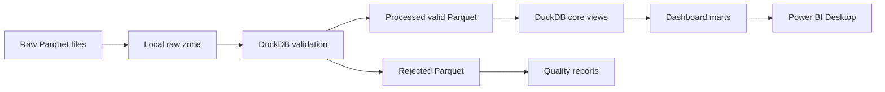

# Data Model Design

## Business Grain

Source grain:

```text
1 row = 1 NYC Yellow Taxi trip
```

Analytics grain ที่แนะนำ:

- Trip-level fact สำหรับ detail analysis
- Daily/hourly mart สำหรับ dashboard performance
- Zone pair mart สำหรับ pickup/dropoff movement
- Data quality mart สำหรับความน่าเชื่อถือของ pipeline

## Local Layered Design



## Recommended Local Layers

| Layer | Location | Purpose |
|---|---|---|
| Raw | `data/raw` | Immutable source files |
| Processed | `data/processed` | Valid trips after quality checks |
| Rejected | `data/rejected` | Invalid rows with rejection reasons |
| Reports | `reports` | Monthly quality reports |
| Marts | DuckDB views or `exports` | Business-friendly datasets for Power BI |

## Processed Fact Table Concept

The processed Parquet files behave like a local fact table:

```text
fact_yellow_trips
```

Partition folder pattern:

```text
data/processed/year=YYYY/month=MM/*.parquet
```

เหตุผล:

- แยกข้อมูลตามเดือนให้จัดการง่าย
- Power BI และ DuckDB อ่าน Parquet ได้สะดวก
- Query เฉพาะเดือน/ปีได้ง่าย
- เหมาะกับ GitHub portfolio เพราะ code กับ data แยกกันชัดเจน

## Core View

Suggested view:

```text
vw_trip_enriched
```

View นี้ควรมี fields:

- trip timestamps
- pickup/dropoff date, month, hour, day of week
- trip duration
- fare metrics
- payment labels
- airport/congestion indicators
- source metadata

## Dashboard Marts

| Mart | Grain | Dashboard Use |
|---|---|---|
| `mart_daily_kpis` | 1 row per pickup date | KPI trend |
| `mart_hourly_demand` | 1 row per pickup hour | Peak-hour analysis |
| `mart_payment_mix` | 1 row per month/payment type | Payment behavior |
| `mart_zone_pair_performance` | 1 row per pickup/dropoff zone pair | Route and zone analysis |
| `mart_data_quality_summary` | 1 row per source month | Trust and monitoring |

## Professional Modeling Rules

- แยก raw, processed, rejected และ mart ให้ชัด เพื่อให้ lineage อธิบายง่าย
- เก็บ rejected data พร้อมเหตุผล ไม่ทิ้งเงียบ ๆ
- ให้ SQL marts เตรียม metric ส่วนใหญ่ไว้ก่อนเข้า Power BI
- ตั้งชื่อ mart ให้ analyst เข้าใจทันที
- แยก metric definition ไว้ในเอกสาร เพื่อให้ dashboard ไม่ตีความคนละแบบ
- ไม่ commit raw/processed/rejected data ขึ้น GitHub

## Metric Definitions

| Metric | Definition |
|---|---|
| Trips | Count of rows in valid trip data |
| Gross Revenue | Sum of `total_amount` |
| Fare Revenue | Sum of `fare_amount` |
| Average Fare | `SUM(total_amount) / COUNT(*)` |
| Average Trip Distance | `AVG(trip_distance)` |
| Average Duration Minutes | `AVG(trip_duration_minutes)` |
| Tip Rate | `SUM(tip_amount) / NULLIF(SUM(fare_amount), 0)` |
| Airport Trip Rate | Trips with `Airport_fee > 0` / total trips |
| Data Rejection Rate | Rejected rows / total source rows |

